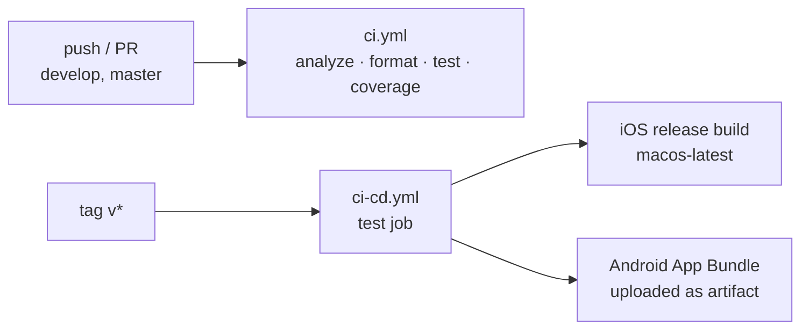

# cicdActions: CI/CD for Flutter with GitHub Actions

Reference pipeline for Flutter projects. The app itself is the default counter template; the point of this repository is the workflows in [`.github/workflows`](.github/workflows).

## `ci.yml`: continuous integration

Runs on every push and pull request to `develop` and `master`:

1. Checkout, Java 17 (Temurin) and Flutter stable with caching ([subosito/flutter-action](https://github.com/subosito/flutter-action)).
2. `flutter pub get` and `flutter analyze`.
3. Formatting gate: `dart format` fails the build if `lib/` or `test/` are not formatted.
4. `flutter test --coverage`, plus a machine-readable JSON test report.
5. Coverage gate with [very_good_coverage](https://github.com/VeryGoodOpenSource/very_good_coverage).

## `ci-cd.yml`: release builds

Runs when a version tag (`v*`) is pushed: the test job runs first, then two builds run in parallel:

- **iOS:** `flutter build ios --release --no-codesign` on `macos-latest`.
- **Android:** `flutter build appbundle`, with `app-release.aab` uploaded as a build artifact.

## Notes

Built in January 2023 and updated in 2026 to current tooling: `actions/checkout@v4`, `actions/setup-java@v4` (Temurin 17), `subosito/flutter-action@v2` with caching, `actions/upload-artifact@v4`, and `dart format` in place of the removed `flutter format`.
